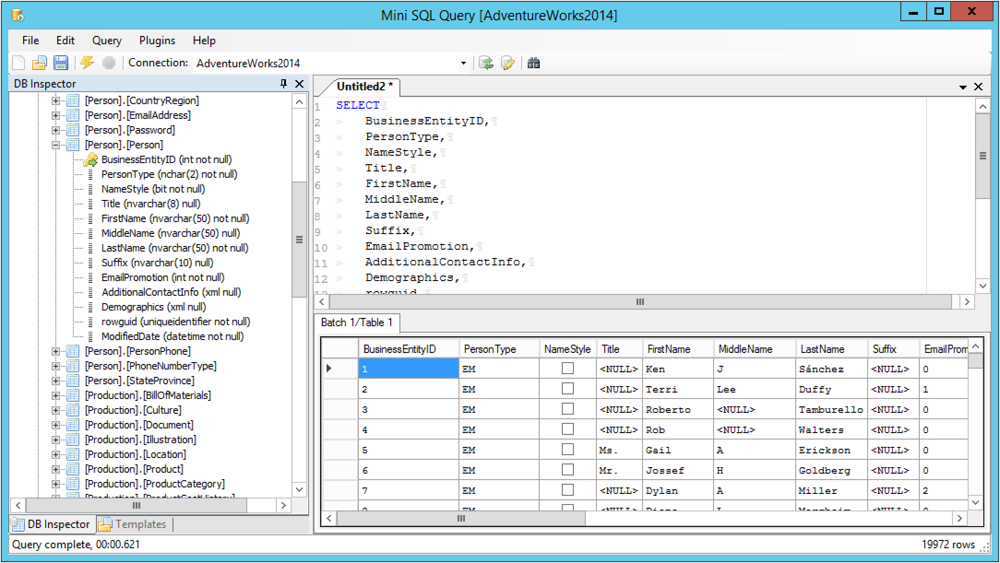

Mini SQL Query
==============

Latest Release...
-----------------

Full release with templates etc:

**[https://github.com/paulkohler/minisqlquery/releases](https://github.com/paulkohler/minisqlquery/releases)**

What is Mini SQL Query
----------------------

> Mini SQL Query is a query tool that makes use of any available .NET DB Provider on your system. It aims to satisfy the most common tasks what the average user seeks to achieve, in doing so it keeps the size and complexity of the application to a minimum. 

Some Core features:

* Supports multiple databases** (MSSQL, SQL Compact Edition, MS Access, SQLite, Oracle, OLEDB, SharePoint - http://blog.bendsoft.com/2013/01/minisqlquery-with-sharepoint-connector-3-0/ etc)
* Integrated text templating system for generating SQL, code or data scripts
* Syntax highlighting (with printing support)
* Load and save SQL script files
* Generic batch support (using the 'GO' keyword but for any DB including SQLite, MSAccess etc)
* Quick View table data
* Basic query generation
* Extensible programming model

**Note that all these types of connections depend on your system configuration (e.g. SQL CE may require an installation)**

Note that the target audience for this tool is not developers who tend to mainly deal with MSSQL, it's geared towards having to hit several different database sources, import and export code, the need to quickly customizing export transforms etc...

Quickstart
==========

For a quick run down, see:

**[https://github.com/paulkohler/minisqlquery/blob/master/src/Docs/Quickstart.md](https://github.com/paulkohler/minisqlquery/blob/master/src/Docs/Quickstart.md)**
